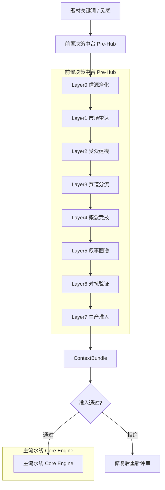

# 🐉 红果剧本一键制造机 V4.0 (Industrial Edition)

[](https://www.python.org/downloads/)
[](https://opensource.org/licenses/MIT)
[](https://help.aliyun.com/zh/dashscope/)

> **愿每一部剧本都能成为千万级爆款。**

**红果剧本一键制造机** 是一款专为短剧从业者设计的工业级自动化生产工具。它采用**双层架构**：前置决策中台（Pre-Hub）负责市场判断与立项评审，主流水线（Core Engine）负责剧本生产。深度集成了阿里云百炼（DashScope）大模型与 Tavily 实时搜索，通过混合 RAG 架构，将碎片化的灵感草稿转化为符合行业标准、具备高转化潜力的成品剧本。

---

## 🏗️ 双层架构 (Dual-Layer Architecture)



### 前置决策中台 (Pre-Hub) - 7层工作流

| Layer | 名称 | 职责 |
|:---:|:---|:---|
| **L0** | 信源净化层 | 时效校验、信源分级、事实/观点分桶、热度归一 |
| **L1** | 市场雷达层 | 赛道热力图、形态适配图、贝叶斯自由能评分 |
| **L2** | 受众建模层 | 免疫区/疲惫区/高敏区分析、观看形态矩阵 |
| **L3** | 赛道分流层 | 制作形态分流（真人/AI/混合）+ 内容赛道分流 |
| **L4** | 概念竞技层 | ToT并行方案生成、10维评分、优胜劣汰 |
| **L5** | 叙事图谱层 | GoT依赖图、情绪负债账本、钩子链锁定 |
| **L6** | 对抗验证层 | 10项必检、Devil's Advocate、伪创新识别 |
| **L7** | 生产准入层 | 颁发准入护照、生成ContextBundle |

### 主流水线 (Core Engine)

| 模块 | 职责 |
|:---|:---|
| **Parser** | LLM智能解析，草稿 → 结构化JSON |
| **Renderer** | 格式渲染，JSON → 工业排版剧本 |
| **Validator** | 商业质检，12项健康指标校验 |
| **Session Cache** | Token消耗降低最高40% |
| **AIMD Limiter** | 自动规避429限流 |

---

## 🚀 核心优势 (Core Advantages)

### 1. 🧠 智能立项决策
- **7层前置工作流**：在真正写作前完成市场验证、赛道判断、概念竞技
- **贝叶斯自由能量尺**：量化"新鲜度-困惑度-可整合度"，确保创新与可读性平衡
- **ToT方案竞技**：并行生成3-5个候选方案，优选后再进入生产

### 2. ⚡ 极限性能与成本控制 (Performance)
- **Session Cache 深度集成**：适配 DashScope 最新 Responses API，Token消耗最高降低 **40%**
- **AIMD 智能降频**：内置工业级 AIMD 并发控制算法，彻底杜绝 `429 Too Many Requests`

### 3. 🧪 神经科学级质量控制 (QA)
- **12项剧本健康指标**：黄金前三集钩子、双线冲突密度、单集反转点、付费点卡位等
- **对抗验证层**：主动识别套路换皮、伪创新、角色降智等致命问题

---

## 🕹️ 使用方式 (Usage)

### 方式一：完整流程（推荐）

```bash
# Step 1: 前置评审 - 立项决策
python -m scripts.preflight "都市复仇" --format real

# Step 2: 主流水线 - 剧本生产
python -m scripts.cli run
```

### 方式二：直接生产（快速迭代）

```bash
# 直接走主流水线，跳过前置评审
python -m scripts.cli run --no-cache
```

### preflight 命令参数

| 参数 | 说明 | 示例 |
|:---|:---|:---|
| `topic` | 项目题材/关键词（必需） | `"都市复仇"` |
| `--format`, `-f` | 制作形态 | `real` / `ai` / `mixed` |
| `--author` | 作者ID | `my_id` |
| `--no-rag` | 禁用RAG增强 | - |
| `--output`, `-o` | 保存报告文件 | `./report.md` |
| `--save-bundle` | 保存ContextBundle | `./bundles/` |

---

## 📂 目录结构 (Architecture)

```text
.
├── core_engine/          # 主流生产引擎
│   ├── parser.py         # LLM解析器
│   ├── renderer.py       # 格式渲染器
│   ├── validator.py      # 商业质检器
│   ├── batch_processor.py # 批处理器
│   ├── main_pipeline.py  # 流水线入口
│   └── ...
├── pre_hub/              # [新增] 前置决策中台
│   ├── pre_hub.py        # 7层协调器
│   ├── layer0_source_guard/  # 信源净化
│   ├── schemas/
│   │   └── pre_hub_models.py # 前置中台数据模型
│   └── ...
├── rag_engine/           # RAG混合检索引擎
│   ├── retriever.py      # 混合检索器
│   ├── tavily_search.py  # Tavily联网搜索
│   └── bailian_retriever.py # 阿里云百炼向量库
├── scripts/              # CLI命令行入口
│   ├── cli.py           # 主流水线CLI
│   └── preflight.py      # 前置评审CLI
├── drafts/               # [输入] 原始灵感草稿
├── scripts_output/       # [输出] 成品剧本
├── reports/              # [输出] 质量诊断报告
├── knowledge_base/       # RAG知识库存储
├── templates/            # 剧本模板与灵感卡片
├── config.yaml           # 全局工业配置
└── 启动器.bat            # 一键式管理控制入口
```

---

## 🛠️ 快速开始 (Quick Start)

### 1. 环境初始化
```bash
# 克隆项目后，推荐使用 Python 3.11+
python -m pip install -e .
```

### 2. 配置 API
复制环境配置文件（或直接修改 `config.yaml`）：
- 填写 `DASHSCOPE_API_KEY` (阿里云百炼)
- 填写 `TAVILY_API_KEY` (可选，用于前置评审的市场雷达)

### 3. 启动项目

**方式一**：双击 `启动器.bat`，按编号选择功能

**方式二**：命令行

```bash
# 前置评审
python -m scripts.preflight "战神" --format real

# 主流生产
python -m scripts.cli run
```

---

## 📊 准入护照示例

```
============================================================
[PREFLIGHT PASSPORT] 准入护照
============================================================
项目ID: proj_7dccb9db_1775670062
项目标题: 都市复仇
准入状态: [PASS] 通过
总分: 60/100
过期时间: 2026-04-23 01:41

各关卡得分:
  信源净化: #########- 90
  市场雷达: #######--- 75
  受众建模: #######--- 70
  赛道分流: ########-- 80
  概念竞技: ########-- 85
  叙事图谱: #######--- 75
  对抗验证: ######---- 60

============================================================
[SUCCESS] 项目通过准入，可以使用 ContextBundle 继续主流水线！
```

---

## 🛡️ 维护与日志

- **实时日志**：详见 `logs/`，采用结构化 JSON 记录，方便回溯生成逻辑
- **快照恢复**：系统每一步处理都会生成快照，若遇断电或中断，可从 `.cache/` 自动恢复任务
- **准入护照**：有效期14天，过期需重新评审

---

## 🔮 技术栈

| 组件 | 技术 |
|:---|:---|
| LLM | 阿里云 DashScope (Qwen3.6-plus) |
| 检索 | 阿里云百炼向量库 + Tavily实时搜索 |
| 缓存 | Session Cache (Token节省40%) |
| 限流 | AIMD自适应算法 |
| 数据模型 | Pydantic v2 |

---

*Developed with ❤️ for Script Writers.*
